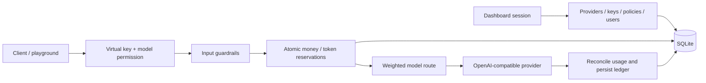

# Architecture

- `server/`: Fastify administration, proxy, credentials, SQLite migrations and CLI.
- `client/`: React dashboard and playground; Vite produces `dist/`.
- `build/`: compiled Node server and CLI, generated by TypeScript.
- `tests/`: local mock-provider integration checks.
- `packaging/python/`: thin Python launcher containing the same npm runtime archive.
- `scripts/`: release assembly, artifact checks and smoke tests.
- `docs/`: installation, operation and release guidance.

The npm archive, wheel and container all execute the same Node server. The server needs Node's built-in SQLite API; the container supplies Node 24. Dashboard files are served from the installed package, independently of the launch directory.

A single process owns each data directory. SQLite transactions prevent concurrent requests from consuming the same reserved quota. Completed usage survives request-log cleanup. Model calls are retried only after explicit HTTP 429 responses; ambiguous failures retain estimated charges.

Schema version 3 is independent of application version 0.2.0. All changes use explicit migrations. The current workspace model is preparatory isolation, not multi-tenant SaaS. Native Bedrock Converse/IAM, SSO, billing and multiple gateway workers are future work.
